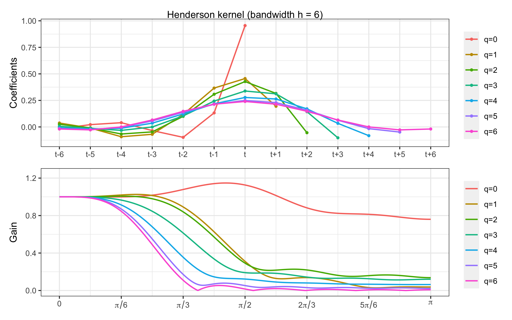

# Introduction {#intro}

```{r, toto=TRUE, echo = TRUE}
# save the built-in output hook
hook_output <- knitr::knit_hooks$get("output")

# # set a new output hook to truncate text output
# knitr::knit_hooks$set(output = function(x, options) {
#   if (!is.null(options$toto) && options$toto) {
#     x <- paste("toto", x, collapse = "\n")
#   }
#   hook_output(x, options)
# })
# 
# 1+1
knitr::opts_current$get()
```


```{r, fig.source="toto"}
# knitr::knit_hooks$set(plot = function(x, options) {
#     knitr::knit_hooks$get('plot')(x, options)
# })
plot(sin, -pi, 2*pi)
```

```{r, fig.source = "tata", fig.cap="titi"}
# local({hook_source <- knitr::knit_hooks$get('plot')
# knitr::knit_hooks$set(plot = function(x, options) {
#     hook_source(x, options)
# })})

```

