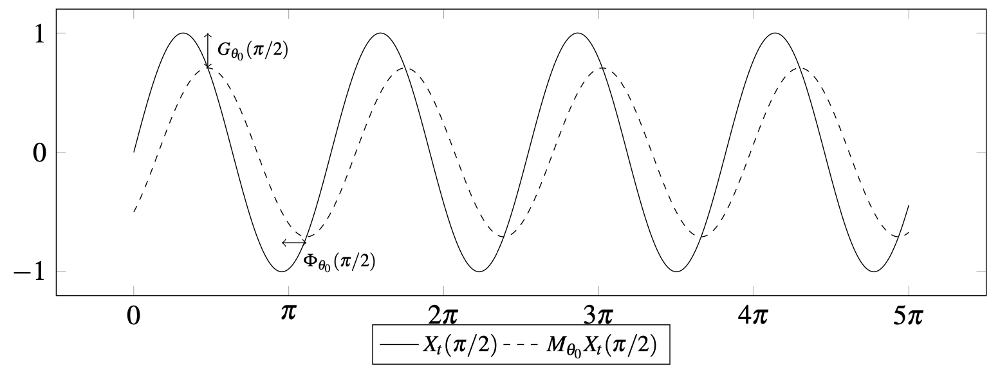

# Moving average and filters {#sec:propMM}

<!-- [toto]: sec-propMM.html#toto  "1" -->

<!-- ello Here is [1][toto] -->

<!-- \@ref(toto) -->


Cette section décrit des définitions et les propriétés des moyennes mobiles (voir par exemple @ch12HBSA pour plus de détails). 

Soient deux entiers $p$ et $f$. Une *moyenne mobile* $M_\theta$ ou $M$ est un opérateur linéaire définit par un ensemble de coefficients $\theta=(\theta_{-p},\dots,\theta_{f})'$ qui transforme toute série temporelle $X_t$ en :
$$
M_\theta(X_t)=\sum_{k=-p}^{+f}\theta_kX_{t+k}.
$$

- $p+f+1$ est appelée *ordre de la moyenne mobile*.

- Lorsque $p=f$ la moyenne mobile est dite *centrée*. 
Si de plus on a $\forall k:\:\theta_{-k} = \theta_k$, la moyenne mobile $M_\theta$ est dite *symétrique*. 
Dans ce cas, la quantité $h=p=f$ est appelée *fenêtre* (*bandwidth*).


## Gain et fonction de déphasage

Soit $X_t=\e^{-i\omega t}$. La moyenne mobile $M_\theta$ transforme $X_t$ en :
$$
Y_t = M_{\theta}X_t = \sum_{k=-p}^{+f} \theta_k \e^{-i \omega (t+k)}
= \left(\sum_{k=-p}^{+f} \theta_k \e^{-i \omega k}\right)\cdot X_t.
$$
La fonction $\Gamma_\theta(\omega)=\sum_{k=-p}^{+f} \theta_k e^{-i \omega k}$ est appelée *fonction de transfert* ou *fonction de réponse en fréquence* (*frequency response function*)^[
La fonction de transfert peut être définie de manière équivalente par $\Gamma_\theta(\omega)=\sum_{k=-p}^{+f} \theta_k e^{i \omega k}$ ou $\Gamma_\theta(\omega)=\sum_{k=-p}^{+f} \theta_k e^{2\pi i \omega k}$.
].
Elle peut être réécrite en :
$$
\Gamma_\theta(\omega) = G_\theta(\omega)\e^{-i\Phi_\theta(\omega)},
$$
où $G_\theta(\omega)=\lvert\Gamma_\theta(\omega)\rvert$ est la fonction de *gain* ou *d'amplitude* et $\Phi_\theta(\omega)$ est le *déphasage* (*phase shift* ou *time shift*)^[
Cette fonction est parfois définie comme  $\phi_\theta(\omega)=\frac{\Phi_\theta(\omega)}{\omega}$ pour mesurer le déphasage en termes de période.
]. 
Pour tous les filtres symétriques on a $\Phi_\theta(\omega)\equiv 0 \pmod{\pi}$.

En somme, l'application d'une moyenne mobile à une série harmonique la modifie de deux façons :

- en la multipliant par un coefficient égal à $G_{\theta}\left(\omega\right)$ ;

- en la "décalant" dans le temps de $\Phi_\theta(\omega)/\omega$, ce qui a un impact sur la détection des points de retournement^[
Lorsque $\Phi_\theta(\omega)/\omega>0$ le déphasage est positif: le point de retournement est détecté avec retard.
].

Par exemple, avec $M_{\theta_0}X_t=\frac{1}{2}X_{t-1}+\frac{1}{2}X_{t}$ on a:
$$
\Gamma_{\theta_0}(\omega)=\frac{1}{2}+\frac{1}{2}\e^{-i\omega}
=\lvert\cos(\omega/2)\rvert\e^{-i\frac{\omega}{2}}
$$
La figure \@ref(fig:exgainPhase) trace le gain et le déphasage pour $\omega=\pi/2$ and $X_t=\sin(\omega t)$.

\begin{figure}[!ht]
\pgfplotsset{width=\textwidth,height=6cm,every axis legend/.append style={font=\footnotesize,
  at={(0.5,-0.1)},
  anchor=north}
    }
\begin{tikzpicture}
\begin{axis}[
legend columns=2,
legend style = {fill=none , fill opacity=0, draw opacity=1,text opacity=1},
xtick={0,3.14159,...,15.70795},
xticklabels={0,$\pi$,$2\pi$,$3\pi$,$4\pi$,$5\pi$} 
]
\addplot[domain=0:5*pi,smooth,samples=300]    plot (\x,{sin(\x * (pi/2) r)});
\addlegendentry{$X_t(\pi/2)$}
\addplot[domain=0:5*pi,smooth,samples=300, dashed]    
  plot (\x,{1/2*sin(\x* pi/2 r )+1/2*sin((\x -1) * pi/2 r)});
\addlegendentry{$M_{\theta_0}X_t(\pi/2)$}
\draw[<->](axis cs: 1.5,1)--(axis cs: 1.5,0.7071068)
  node[pos=0.5, right]{\scriptsize $G_{\theta_0}(\pi/2)$};
\draw[<->] (axis cs: 3, -0.70710680-0.05)--(axis cs: 3.5,-0.7071068-0.05) 
  node[pos=0.5, below right]{\scriptsize $\Phi_{\theta_0}(\pi/2)$};
\end{axis}
\end{tikzpicture}
\caption{Lissage de la série $X_t=\sin(\omega t)$ par la moyenne mobile $M_{\theta_0}X_t=\frac{1}{2}X_{t-1}+\frac{1}{2}X_{t}$ pour $\omega=\pi/2$.}\label{fig:exgainPhase}
\end{figure}

```{r exgainPhase, echo=FALSE, out.width="100%", fig.cap="Lissage de la série $X_t=\\sin(\\omega t)$ par la moyenne mobile $M_{\\theta_0}X_t=\\frac{1}{2}X_{t-1}+\\frac{1}{2}X_{t}$ pour $\\omega=\\pi/2$.", eval=!is_latex}

```


## Propriétés souhaitables d'une moyenne mobile

Pour décomposer une série temporelle en une composante saisonnière, une tendance-cyle et l'irrégulier, l'algorithme de décomposition X-11 utilise une succession de moyennes mobiles ayant toutes des contraintes spécifiques. Dans cette sous-section nous décrivons trois types de contraintes :

- la préservation de certaines tendances ;

- suppression de la saisonnalité ;

- la réduction du bruit.

### Préservation de tendances

Il est souvent souhaitable qu'une moyenne mobile conserve certaines tendances.
Une moyenne mobile $M_\theta$ conserve une fonction du temps $f(t)$ si $\forall t:\:M_\theta f(t)=f(t)$.

Nous avons les propriétés suivantes pour la moyenne mobile $M_\theta$ :

- Pour conserver les constantes $X_t=a$ il faut que
$$
\forall t:M_\theta(X_t)=\sum_{k=-p}^{+f}\theta_kX_{t+k}=\sum_{k=-p}^{+f}\theta_ka=a\sum_{k=-p}^{+f}\theta_k=a.
$$
C'est-à-dire qu'il faut que la somme des coefficients $\sum_{k=-p}^{+f}\theta_k$ soit égale à $1$.

- Pour conserver les tendances linéaires $X_t=at+b$ il faut que :
$$
\forall t:\:M_\theta(X_t)=\sum_{k=-p}^{+f}\theta_kX_{t+k}=\sum_{k=-p}^{+f}\theta_k[a(t+k)+b]=at\sum_{k=-p}^{+f}k\theta_k+b\sum_{k=-p}^{+f}\theta_k=at+b.
$$
Ce qui est équivalent à :
$$
\sum_{k=-p}^{+f}\theta_k=1
\quad\text{and}\quad
\sum_{k=-p}^{+f}k\theta_k=0.
$$
- De manière générale, $M_\theta$ conserves les tendances de degré $d$ si et seulement si :
$$
\sum_{k=-p}^{+f}\theta_k=1 
 \text{ et } 
\forall j \in \left\llbracket 1,d\right\rrbracket:\:
\sum_{k=-p}^{+f}k^j\theta_k=0.
$$
- Si $M_\theta$ est symétrique ($p=f$ et $\theta_{-k} = \theta_k$) et conserve les tendances de degré $2d$ alors elle conserve aussi les tendances de degré $2d+1$.

### Élimination de la saisonnalité

Soit $S_t$ une série à saisonnalité fixe de périodicité $P$ ($P=12$ pour une série mensuelle, $P=4$ pour une série trimestrielle, etc.). 
On a donc $S_t=S_{t+P}$ et la somme de $P$ termes consécutifs est constante dans le temps^[
Dans le cadre de la désaisonnalisation, cette constante est supposée égale à 0 car dans le cas contraire cette constante serait plutôt affectée à la composante tendance-cycle.
]. Ainsi, une moyenne mobile simple d'ordre $P$ (dont tous les coefficients sont égaux à $1/P$) supprime les saisonnalités fixes.

Il est également possible de constituer des moyennes mobiles plus complexes supprimant la saisonnalité qui évoluerait polynomialement dans le temps (voir par exemple @GrunRehommeLadiray1994)


### Réduction du bruit

Toutes les séries temporelles sont affectées par du bruit qui peut brouiller l'extraction du signal. 
C'est pourquoi on cherche à réduire ce bruit (en réduisant la variance) tout en conservant le signal (en utilisant les propriétés vues dans les sections précédentes).
La somme des carrés des coefficients $\sum_{k=-p}^{+f}\theta_k^2$ est le rapport de *réduction de la variance*.

En effet, soit $\{\varepsilon_t\}$ une suite de variables aléatoires indépendantes avec $\E{\varepsilon_t}=0$, $\V{\varepsilon_t}=\sigma^2$. 
On a :
$$
\V{M_\theta\varepsilon_t}=\V{\sum_{k=-p}^{+f} \theta_k \varepsilon_{t+k}}
= \sum_{k=-p}^{+f} \theta_k^2 \V{\varepsilon_{t+k}}=
\sigma^2\sum_{k=-p}^{+f} \theta_k^2.
$$

## Real-time estimation and asymmetric moving average {#defAsymProb}

For symmetric filters, the phase shift function is equal to zero (modulo $\pi$).
Therefore, there is no delay in any frequency: that's why they are preferred to the asymmetric ones. 
However, they cannot be used in the beginning and in the end of the time series because no past/future value can be used. 
Thus, for real-time estimation, it is needed to build asymmetric moving average that approximate the symmetric moving average.

The approximation is summarized by quality indicators. 
In this paper we focus on the ones defined by @ch15HBSA and @trilemmaWMR2019 to build the asymmetric filters.

@ch15HBSA propose a general approach to derive linear filters, based on an optimization problem of three criteria: *Fidelity* ($F_g$, noise reduction), *Smoothness* ($S_g$) and *Timeliness* ($T_g$, phase shift between input and ouput signals). 
See section \@ref(sec:GuggemosEtAl) for more details.

@trilemmaWMR2019 propose an approach based on the decomposition of the mean squared error between the symmetric and the asymmetric filter in four quantities: *Accuracy* ($A_w$), *Timeliness* ($T_w$), *Smoothness* ($S_w$) and *Residual* ($R_w$).
See section \@ref(sec:WildiMcLeroy) for more details.

All the indicators are summarized in table \@ref(tab:QC).

\begin{table}[!ht]
$$\begin{array}{ccc}
\hline \text{Sigle} & \text{Description} & \text{Formula}\\
\hline b_{c} & \text{Constant bias} & \sum_{k=-p}^{+f}\theta_{k}-1\\
\hline b_{l} & \text{Linear bias} & \sum_{k=-p}^{+f}k\theta_{k}\\
\hline b_{q} & \text{Quadratic bias} & \sum_{k=-p}^{+f}k^{2}\theta_{k}\\
\hline F_{g} & \text{Variance reduction / Fidelity (Guggemos)} & \sum_{k=-p}^{+f}\theta_{k}^{2}\\
\hline S_{g} & \text{Smoothness (Guggemos)} & \sum_{j}(\nabla^{3}\theta_{j})^{2}\\
\hline T_{g} & \text{Timeliness (Guggemos)} & \int_{0}^{2\pi/12}\rho_{\theta}(\omega)\sin(\varphi_{\theta}(\omega))^{2}\ud\omega\\
\hline A_{w} & \text{Accuracy (Wildi)} & 2\int_0^{2\pi/12}\left(\rho_{s}(\omega)-\rho_{\theta}(\omega)\right)^{2}h_{RW}(\omega)\ud\omega\\
\hline T_{w} & \text{Timeliness (Wildi)} & 8\int_0^{2\pi/12} \rho_{s}(\omega)\rho_{\theta}(\omega)\sin^{2}\left(\frac{\varphi_s(\omega)-\varphi_\theta(\omega)}{2}\right)h_{RW}(\omega)\ud\omega\\
\hline S_{w} & \text{Smoothness (Wildi)} & 2\int_{2\pi/12}^{\pi}\left(\rho_{s}(\omega)-\rho_{\theta}(\omega)\right)^{2}h_{RW}(\omega)\ud\omega\\
\hline R_{w} & \text{Residual (Wildi)} & 8\int_{2\pi/12}^{\pi} \rho_{s}(\omega)\rho_{\theta}(\omega)\sin^{2}\left(\frac{\varphi_s(\omega)-\varphi_\theta(\omega)}{2}\right)h_{RW}(\omega)\ud\omega\\
\hline \\
\end{array} $$
\caption{Criteria used to check the quality of a linear filter defined by its coefficients $\theta=(\theta_k)_{-p\leq k\leq f}$ and its gain and phase shift function, $\rho_{\theta}$ and $\varphi_\theta$.} 
\label{tab:QC}
\footnotesize
\emph{Note: $X_g$ criteria are derived from \textcite{ch15HBSA} and $X_w$ criteria from \textcite{trilemmaWMR2019}.}

\emph{$\rho_s$ and $\varphi_s$ represent the gain and phase shift function of the Henderson symmetric filter.}

\emph{$h_{RW}$ is the spectral density of a random walk: $h_{RW}(\omega)=\frac{1}{2(1-\cos(\omega))}$.}
\end{table}

```{r QC, echo = FALSE, eval=is_html}
criteria_mm <- data.frame(Sigle = c("b_c", "b_l", "b_q",
                                    "F_g", "S_g", "T_g",
                                    "A_w", "T_w", "S_w", "R_w"),
                          Description = c(sprintf("%s bias", c("Constant", "Linear", "Quadratic")),
                                          sprintf("%s (Guggemos)",
                                                  c("Variance reduction / Fidelity", "Smoothness", "Timeliness")),
                                          sprintf("%s (Wildi)",c("Accuracy", "Timeliness", "Smoothness", "Residual"))),
                          Formula = c("\\sum_{k=-p}^{+f}\\theta_{k}-1",
                                      "\\sum_{k=-p}^{+f}k\\theta_{k}",
                                      "\\sum_{k=-p}^{+f}k^{2}\\theta_{k}",
                                      "\\sum_{k=-p}^{+f}\\theta_{k}^{2}",
                                      "\\sum_{j}(\\nabla^{3}\\theta_{j})^{2}",
                                      "\\int_{0}^{2\\pi/12}\\rho_{\\theta}(\\omega)\\sin(\\varphi_{\\theta}(\\omega))^{2}\\ud\\omega",
                                      "2\\int_0^{2\\pi/12}\\left(\\rho_{s}(\\omega)-\\rho_{\\theta}(\\omega)\\right)^{2}h_{RW}(\\omega)\\ud\\omega",
                                      "8\\int_0^{2\\pi/12} \\rho_{s}(\\omega)\\rho_{\\theta}(\\omega)\\sin^{2}\\left(\\frac{\\varphi_s(\\omega)-\\varphi_\\theta(\\omega)}{2}\\right)h_{RW}(\\omega)\\ud\\omega",
                                      "2\\int_{2\\pi/12}^{\\pi}\\left(\\rho_{s}(\\omega)-\\rho_{\\theta}(\\omega)\\right)^{2}h_{RW}(\\omega)\\ud\\omega",
                                      "8\\int_{2\\pi/12}^{\\pi} \\rho_{s}(\\omega)\\rho_{\\theta}(\\omega)\\sin^{2}\\left(\\frac{\\varphi_s(\\omega)-\\varphi_\\theta(\\omega)}{2}\\right)h_{RW}(\\omega)\\ud\\omega"))
criteria_mm[,1] <- sprintf("$%s$", criteria_mm[,1])
criteria_mm[,3] <- sprintf("$%s$", criteria_mm[,3])
library(kableExtra)
title <- "Criteria used to check the quality of a linear filter defined by its coefficients $\\theta=(\\theta_k)_{-p\\leq k\\leq f}$ and its gain and phase shift function, $\\rho_{\\theta}$ and $\\varphi_\\theta$."
footnotes <- c("$X_g$ criteria are derived from @ch15HBSA and $X_w$ criteria from @trilemmaWMR2019.",
               "$\\rho_s$ and $\\varphi_s$ represent the gain and phase shift function of the Henderson symmetric filter.",
               "$h_{RW}$ is the spectral density of a random walk: $h_{RW}(\\omega)=\\frac{1}{2(1-\\cos(\\omega))}$."
)

criteria_mm %>% 
  kbl(align = "c", booktabs = T, row.names = FALSE,
        escape = FALSE,caption = title) %>% 
    footnote(general=footnotes, escape = FALSE)
```


