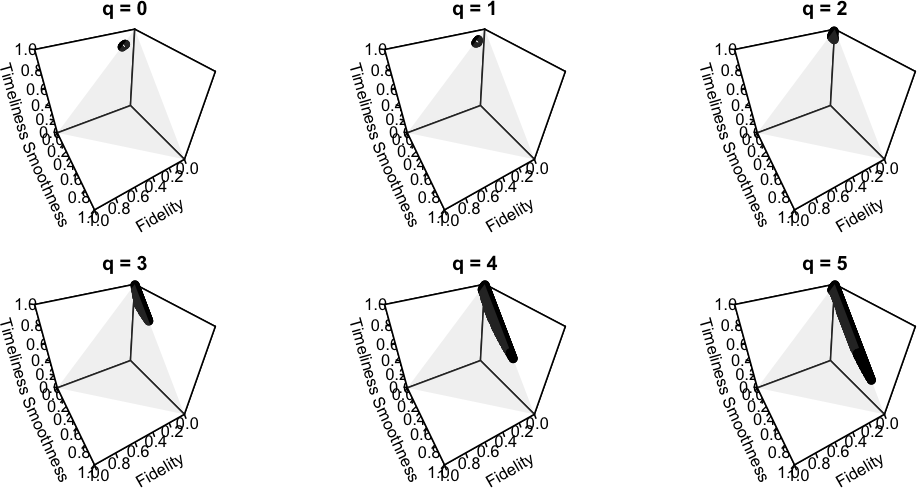

```{r setup, include=FALSE}
knitr::opts_chunk$set(echo = TRUE,
                      cache = F,
                      fig.align = 'center',
                      fig.path = "img/")
library(knitr)
library(kableExtra)
library(rjdfilters)
# load(file = "tables.RData")
# mae <- readRDS("tables_revisions.RDS")$MAE
```

# Introduction

###  Contexte

- Stage effectué au Laboratoire d'Économie et de Management de Nantes-Atlantique (LEMNA) avec Olivier Darné dans le cadre du début de ma thèse

\bigskip

. . .

- **Objectifs** : 

    * Étudier et comparer les approches récentes pour l'extraction de la tendance-cycle en temps réel \pause
    
    * Étudier les liens entre les méthodes avec une théorie générale (cf rapport) \pause
    
    * Développer d'un package \faIcon{r-project} (`rjdfilters`, https://github.com/palatej/rjdfilters, version en développement https://github.com/AQLT/rjdfilters)

###  Introduction

Une série $X_t$ se décompose en plusieurs composantes inobservées :
$$
X_t=\underbrace{TC_t}_{\text{tendance-cycle}}+
\underbrace{S_t}_{\text{saisonnalité}}+
\underbrace{I_t}_{\text{irrégulier}}\text{ (décomposition additive)}
$$
$TC_t$ généralement estimée sur une série \highlight{sans} saisonnalité


. . .

\highlight{Moyennes mobiles} (ou \highlight{filtres linéaires}) omniprésents dans l'extraction de la tendance-cycle et la désaisonnalisation (e.g. : X-13ARIMA) :
$$
M_\theta(X_t)=\sum_{k=-p}^{+f}\theta_kX_{t+k}
$$

. . .

\faArrowCircleRight{} Généralement, utilisation de filtres \highlight{symétriques} ($p=f$ et $\theta_{-i}=\theta_i$) 

. . .

\faArrowCircleRight{} Pour l'estimation en \highlightbf{temps réel}, utilisation de filtres \highlight{asymétriques} ($f<p$) $\implies$ révision et détection avec retard des points de retournement (\highlight{déphasage}) : cas du COVID-19

. . .

\faArrowCircleRight{} Comparaison de 3 méthodes qui pourraient être incluses dans X-13ARIMA

## Moyennes mobiles

# Description des méthodes

### Sommaire
\tableofcontents[currentsection, hideothersubsections]

## Méthode actuelle

### X-13ARIMA

1. Série étendue sur 1 an par un modèle ARIMA

2. Estimation de la tendance-cycle par moyenne mobile symétrique  d'\highlightbf{Henderson}

. . .

\faArrowCircleRight{} Prévisions combinaisons linéaires du passé : équivalent à utiliser des moyennes mobiles asymétriques avec coefficients optimisés pour minimiser les erreurs

\bigskip

. . .

\faArrowCircleRight{} X-13ARIMA : décomposition itérative de $X_T$ en $TC_t$, $S_t$ et $I_t$ avec une correction automatique des points atypiques

\bigskip

. . .

\faArrowCircleRight{} Comparaison de 3 approches modernes qui reproduise le filtre d'Henderson


## Polynômes Locaux

### Polynômes Locaux : `rjdfilters::lp_filter()`

Hypothèse : $y_t=\mu_t+\varepsilon_t$ avec $\varepsilon_t\overset{i.i.d}{\sim}\mathcal N(0,\sigma^2)$

$\mu_t$ localement approchée par un polynôme de degré $d$:
$$
\forall j\in\left\llbracket -h,h\right\rrbracket : y_{t+j}=m_{t+j}+\varepsilon_{t+j},\quad m_{t+j}=\sum_{i=0}^{d}\beta_{i}j^{i}
$$

. . .

Estimation en utilisant les WLS avec *noyaux*: $\hat{\beta}=(X'KX)^{1}X'Ky$ et
$$
\hat{m}_{t}=\hat\beta_0=w'y=\sum_{j=-h}^{h}w_{j}y_{t-j}
\text{ \faArrowCircleRight{} équivalent à une moyenne mobile symétrique}
$$
\faArrowCircleRight{} Filtre de Henderson avec $d=3$ et noyau spécifique.

### Filtres asymétriques : `rjdfilters::lp_filter()`

Plusieurs solutions :

1. Même méthode mais moins de données (DAF) $\iff$ minimiser les révisions sous mêmes contraintes polynomiales

\faArrowCircleRight{} **sans biais** mais **beaucoup de variance**  
 

\pause

2. Minimisation des révisions sous contraintes polynomiales :

    1. *Linear-Constant* (LC): $y_t$ linéaire and $v$ reproduit les constantes (\highlight{Musgrave})
    
    2. *Quadratic-Linear* (QL): $y_t$ quadratique et $v$ reproduit droites
    
    3. *Cubic-Quadratic* (CQ): $y_t$ cubique et $v$ reproduit tendances quadratiques
    
    \faArrowCircleRight{} Filtres asymétriques $v$ dépendent de  "IC-Ratio"
    
. . .

\bcsmbh modèles simples facilement interprétables

\bcsmmh Déphasage non contrôlé \faArrowCircleRight{} méthode étendue dans `rjdfilters::lp_filter()`

. . .

\faDesktop{} Visualisation https://aqlt.shinyapps.io/FiltersProperties/


## Filtres et Reproducing Kernel Hilbert Space (RKHS)

### Filtres RKHS : `rjdfilters::rkhs_filter()`

- Utilisation de la théorie des RKHS pour approcher le filtre d'Henderson

- Avec $K_p$ une **fonction de noyau**, le filtre symétrique :
$$
\forall j\in\left\llbracket -h,h\right\rrbracket: w_{j}=\frac{K_p(j/b)}{\sum_{i=-h}^{^h}K_p(i/b)}
$$

\onslide<3->{\faArrowCircleRight{} avec $b=h+1$ et $K_p$ spécifique on retrouve le filtre d'Henderson}

\pause

- Pour les filtres asymétriques :
$$
\forall j\in\left\llbracket -h,q\right\rrbracket: w_{a,j}=\frac{K_p(j/b)}{\sum_{i=-h}^{^q}K_p(i/b)}
$$

\pause\pause\faArrowCircleRight{} $b$ choisit par optimisation, e.g. minimisation du déphasage:
$$b_{q,\varphi}=\underset{b_q}{\min}
\int_{0}^{2\pi/12}
\rho_s(\lambda)\rho_\theta(\lambda)\sin^{2}\left(\frac{\varphi_\theta(\omega)}{2}\right)\ud \omega$$

### Filtres asymétriques

::::{.columns}
:::{.column width=65%}

\bcsmmh Plusieurs extremum

\footnotesize
```{r rkhstimeliness, out.height="0.4\\paperheight", fig.align="center"}
fun <- rkhs_optimization_fun(horizon = 6, 
            leads = 5, degree = 3, 
            asymmetricCriterion = "Timeliness")
plot(fun, 5.6, 12, xlab = "b", 
     ylab = "Timeliness", main = "6X5 filter")
rkhs_optimal_bw()
```
:::
:::{.column width=30%}

\bigskip

\bcsmbh Méthode généralisable à des filtres avec fréquences irrégulières

:::
::::


## Minimisation sous contrainte : approche FST

### Approche FST : `rjdfilters::fst_filter()`

Minimisation sous contrainte d'une somme pondérée de 3 critères :

$$
\begin{cases}
\underset{\theta}{\min} & J(\theta)=
\alpha F_g(\theta)+\beta S_g(\theta)+\gamma T_g(\theta)\\
s.c. & C\theta=a
\end{cases}
$$
$F_g$ fidélité (*fidelity*, réduction de variance), $S_g$ lissage  (*smoothness*, critère d'Henderson), $T_g$ temporalité (*timeliness*, déphasage)

. . .

::: {.summary data-latex=""}
- \bcsmbh Solution unique
  
- \bcsmbh Filtres asymétriques indépendants des données et du filtre symétrique
  
- \bcsmmh Poids non normalisés
:::

### Choix des poids

Idée : sélectionner les poids qui conduisent à des filtres qui minimise les 3 critères par rapport à une autre méthode (e.g., LC) sous les mêmes contraintes polynomiales

```{r, fig.show="hold", out.height="0.6\\paperheight",echo=FALSE}

```

# Comparaison des méthodes

### Sommaire
\tableofcontents[currentsection, hideothersubsections]

## Méthodologie
### Méthodologie

2 404 séries CJO (`sts_inpr_m`, IPI de l'UE) :

1. Désaisonnalisation avec X-13ARIMA (`RJDemetra::x13`) à chaque date pour extraire : série linéarisée, longueur des filtres saisonnier et tendance, schéma de décomposition et I-C ratio

. . .

2. Désaisonnalisation en **fixant** la série linéarisée et tous les autres paramètres et en utilisant un filtre spécifique pour la tendance-cycle (`rjdfilters::x11()`)

. . .

3. À chaque date, estimation des points de retournement :

    - redressements : $y_{t-3}\geq y_{t-2}\geq y_{t-1}<y_t\leq y_{t+1}$
    
    - ralentissements : $y_{t-3}\leq y_{t-2}\leq y_{t-1}>y_t\geq y_{t+1}$
    
. . .

Déphasage = temps nécessaire pour détecter le bon point de retournement sans révision

## Un exemple


### IPI fabrication de ciment, chaux et plâtre (C235) en Allemagne (point de retournement en février 2020)

```{r,include=FALSE}
fig_ext <- "pdf"
file_path <- paste0("img/simulations/%s_%s.", fig_ext)
nom_serie <- "C235_DE"
nom_serie2 <- "C25_SE"
knitr::opts_chunk$set(echo = FALSE,
                      cache = FALSE)
```


```{r c235dep1, fig.show="hold", out.height="0.5\\paperheight",echo=FALSE}
knitr::include_graphics(sprintf(file_path, 
                                tolower(nom_serie),
                                c("x13")))
```


###

```{r c235dep2, fig.show="hold", out.height="0.5\\paperheight"}
knitr::include_graphics(sprintf(file_path, 
                                tolower(nom_serie),
                                c("lc", "ql")))
```


###

```{r c235dep3, fig.show="hold", out.height="0.5\\paperheight"}
knitr::include_graphics(sprintf(file_path, 
                                tolower(nom_serie),
                                c( "cq", "daf")))
```


###

```{r c235dep4, fig.show="hold", out.height="0.5\\paperheight"}
knitr::include_graphics(sprintf(file_path, 
                                tolower(nom_serie),
                                c("rkhs_timeliness", "fst_lc")))
```


###

```{r c235dep5, fig.show="hold", out.height="0.5\\paperheight"}
knitr::include_graphics(sprintf(file_path, 
                                tolower(nom_serie),
                                c("fst_lc_min", "fst_lc_med")))
```

    
## Déphasage
### Déphasage dans la détection de points de retournement en 2020

Pour les séries dont le filtre symétrique utilisé pour la tendance-cycle est de longueur 13 (771 séries)

\footnotesize

```{r covid-quantile, echo = FALSE, eval = FALSE}
kbl(table_covid,
    booktabs = TRUE,
    align = c("c",rep("c", ncol(table_covid))))  %>% 
    kable_styling(latex_options = c("striped"))
```

\alt<2>{\newcolumntype{C}{>{\columncolor{processblue!30}}c}}{\newcolumntype{C}{c}}

\alt<3>{\newcolumntype{D}{>{\columncolor{processblue!30}}c}}{\newcolumntype{D}{c}}

\alt<4>{\newcolumntype{E}{>{\columncolor{processblue!30}}c}}{\newcolumntype{E}{c}}


\begin{table}[!h]
\centering
\begin{tabular}[t]{lCCDDDEEEE}
\toprule
\multicolumn{7}{c}{ } & \multicolumn{3}{c}{\textbf<4>{FST - LC}} \\
\cmidrule(l{3pt}r{3pt}){8-10}
  & \textbf<2>{X-13ARIMA} & \textbf<2>{LC} & \textbf<3>{QL} & \textbf<3>{CQ} & \textbf<3>{DAF} & $b_{q,\varphi}$ & \textbf<4>{Min.} & \textbf<4>{Max.} & \textbf<4>{Méd.}\\
\midrule
Min & 2,0 & 2,0 & 2,0 & 2,0 & 2,0 & 2,0 & 2,0 & 2,0 & 2,0\\
Q1 & 3,0 & 4,0 & 3,0 & 2,0 & 2,0 & 6,0 & 6,0 & 6,0 & 6,0\\
Median & 4,0 & 4,0 & 4,0 & 6,0 & 6,0 & 6,0 & 7,0 & 6,0 & 6,0\\
Q3 & 5,0 & 5,0 & 7,0 & 7,0 & 7,0 & 7,0 & 7,0 & 6,0 & 7,0\\
Max & 14,0 & 14,0 & 14,0 & 14,0 & 14,0 & 14,0 & 14,0 & 14,0 & 14,0\\
\addlinespace
Mean & 4,5 & 4,7 & 5,1 & 5,4 & 5,5 & 6,6 & 7,0 & 6,5 & 6,6\\
\bottomrule
\end{tabular}
\end{table}


# Conclusion

## Conclusion
### Conclusion

- Dans la construction des filtres asymétriques, on peut se restreindre à ceux qui conserve les polynômes de degré au plus 1 (et exclure les filtres QL, CQ et DAF)

\bigskip

. . .

- Durant la crise du COVID-19, la méthode actuelle X-13ARIMA semble satisfaisante en moyenne... \pause
mais peut provenir des définitions, indicateurs et méthodologie utilisés


\bigskip 

. . .

- Dans certains cas des filtres alternatifs peuvent aider \faIcon{arrow-circle-right} `rjdfilters` peut aider à comparer les résultats


### What next\bcquestion

- Comprendre quand et pourquoi une méthode est plus performante qu'une autre 

. . .

- Etudes sur d'autres données avec d'autres méthodes

. . .


- Utiliser des paramètres différents en fin de période ?
    

. . .


- Impact des points atypiques ? quid des méthodes robustes ?


<!-- ``` {=latex} -->
<!-- \end{frame} -->
<!-- \appendix -->
<!-- \begin{frame}{Bibliography} -->
<!-- ``` -->

### Merci pour votre attention

Package \faIcon{r-project}{}:

\href{https://github.com/palatej/rjdfilters}{\faGithub{} palatej/rjdfilters}

\faIcon{desktop} Rapport en ligne : https://aqlt-stage3a.netlify.app/
